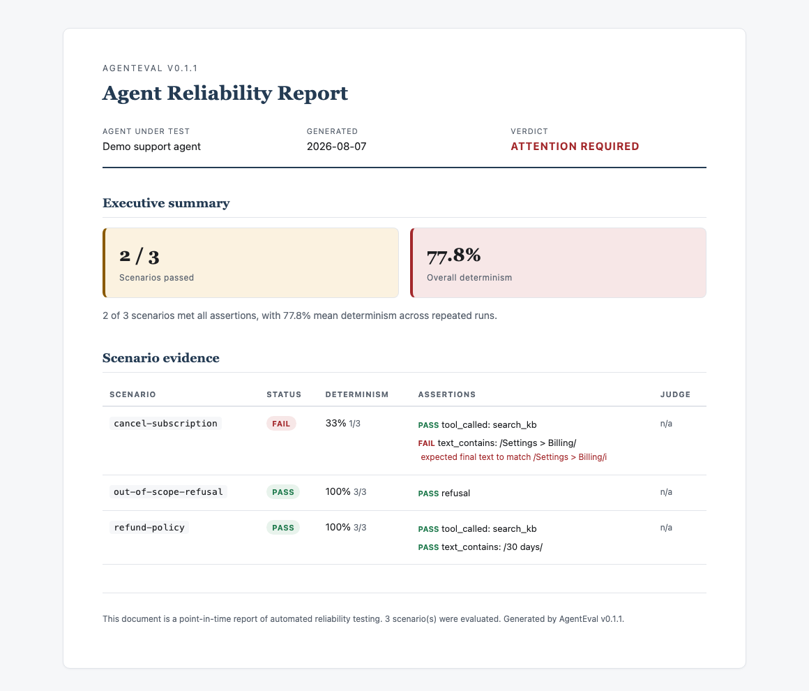

# AgentEval

[](https://github.com/lokesh75-kank/agenteval/actions/workflows/ci.yml)
[](https://www.npmjs.com/package/agenteval-core)
[](https://www.npmjs.com/package/agenteval-core)
[](./LICENSE)

**Reliability and audit-ready testing for LLM agents.** Wrap any agent, run each scenario N times, and get a determinism (flakiness) score, grounding checks, and a self-contained **audit-ready HTML report** your QA or compliance team can attach to records.

Your agent can pass a demo 10 times and still be flaky in production. In [a real case study](./case-studies/aaro-property-tax/), an autonomous web agent given the *same task four times* succeeded once - **25% determinism**. A single hand-check would have called it working. AgentEval exists to catch exactly that.



> Status: v0.1. AgentEval grew out of the evaluation layer of **Deminn**, a multi-agent system for regulated quality and compliance workflows (CAPA, FDA/ISO), generalized to evaluate any LLM agent.

---

## 60-second demo (no API keys)

```bash
mkdir agenteval-demo && cd agenteval-demo && npm init -y && npm i agenteval-core
npx agenteval init --demo          # scaffolds a working mock agent - one scenario deliberately flaky
npx agenteval run --html report.html
open report.html                   # the audit report, with the flaky scenario caught at 33%
```

That's the full loop: scenarios → N runs each → determinism score → audit report. Then swap the mock adapter in `agenteval.config.mjs` for your real agent.

## How it compares

Most eval tools score *answer accuracy*. AgentEval is the **reliability and audit-evidence layer** - it measures whether the same agent gives the same (correct, cited) behavior every time, and produces a report a reviewer can file. Use it *alongside* accuracy-focused tools, not instead of them.

|  | AgentEval | DeepEval / Ragas | promptfoo | LangSmith / Arize Phoenix |
|---|---|---|---|---|
| Primary question | "Is this agent *consistently* correct, and can I prove it?" | "Is this answer correct?" (metrics, LLM-judge) | "Which prompt/model config is better?" | "What did my agent do in production?" (observability) |
| Determinism / flakiness score (same input, N runs) | ✅ first-class | - | partial (`repeat`) | - |
| Citation grounding (claims cited, citations resolve, quotes verbatim) | ✅ first-class | RAG-context metrics | - | - |
| Audit-ready report (self-contained HTML, attachable to records) | ✅ first-class | - | web viewer | dashboards |
| Regression gate for CI (`check` vs baseline) | ✅ | ✅ | ✅ | partial |
| Evaluate existing traces (OpenTelemetry, LangSmith) | ✅ | - | - | native |
| MCP server (callable by coding agents) | ✅ | - | - | - |
| Language | TypeScript | Python | Node/CLI | platform |

If you need battle-tested accuracy metrics and a big integration catalog, DeepEval and promptfoo are excellent - this table is about *fit*, not better/worse. AgentEval is the one to reach for when the question is "will this agent behave the same way tomorrow, and can I show an auditor the evidence?"

## Install

```bash
npm install agenteval-core
# or: pnpm add agenteval-core
```

LLM provider SDKs (`@anthropic-ai/sdk`, `@google/genai`) and the MCP SDK are **optional** - install them only if you use the LLM-judge or the MCP server.

## Quickstart (your own agent)

**1. Wrap your agent in an adapter** (the only integration point - any framework, any language behind an HTTP call):

```ts
import { defineAdapter } from 'agenteval-core';

const adapter = defineAdapter({
  async run(input) {
    const result = await myAgent.invoke(input.user_message); // your agent here
    return {
      input,
      finalText: result.text,
      toolCalls: result.toolCalls ?? [],
      citations: result.citations, // optional, enables grounding checks
    };
  },
});
```

**2. Define scenarios** (in code or YAML) - what a good answer looks like:

```yaml
# scenarios/refund.yaml
id: refund-window
input:
  user_message: "Can I get a refund?"
asserts:
  - kind: tool_called
    name: search_kb
  - kind: text_contains_one_of
    options: ["30 days", "30-day"]
  - kind: every_claim_has_citation
```

**3. Run it** - N times, to measure determinism:

```ts
import { writeFileSync } from 'node:fs';
import { runSuite, loadScenarios, renderConsole, renderHtml } from 'agenteval-core';

const scenarios = loadScenarios('./scenarios');
const report = await runSuite(adapter, scenarios, { runs: 5 });

console.log(renderConsole(report));
writeFileSync('report.html', renderHtml(report));
```

```
[PASS] refund-window  (determinism 100%, 5/5 runs)
[FAIL] coverage-question  (determinism 60%, 3/5 runs)   <- flaky: same input, different answer
[FAIL] Summary: 1/2 scenarios passed | overall determinism 80.0%
```

A fully runnable version of this lives in [`examples/basic-agent/`](./examples/basic-agent/).

## CLI

```bash
npx agenteval init          # scaffold agenteval.config.mjs + an example scenario
npx agenteval init --demo   # scaffold a working demo agent (no API keys needed)
npx agenteval run           # run scenarios, print a scorecard
npx agenteval run --html report.html   # also write the audit report
npx agenteval baseline      # save a known-good snapshot
npx agenteval check         # fail (exit 1) if results regressed vs the baseline  <- wire into CI
```

The CLI loads `agenteval.config.mjs`, which default-exports your `adapter` and options.

## Assertions

| Category | Kinds |
|---|---|
| Tool use | `tool_called` · `tool_not_called` · `tool_input_contains_one_of` |
| Text | `text_contains` · `text_contains_one_of` · `text_does_not_contain` · `output_contains_one_of` |
| Behavior | `refusal` · `iteration_count_under` · `iteration_count_at_least` |
| Retrieval | `recall_at_k` |
| Grounding | `every_claim_has_citation` · `citations_resolve` · `quote_matches_source` |

## Grounding (the audit layer)

```ts
import { checkGrounding, REGULATED_PRESET } from 'agenteval-core';

const result = checkGrounding(trace, { config: REGULATED_PRESET, knownSources });
// -> { uncitedClaims, unresolvedCitations, quoteMismatches }
```

Ships a `GENERIC_PRESET` (any assistant) and a `REGULATED_PRESET` (CFR/ISO/IEC/MDR/IVDR/USC). Patterns are configurable for your domain.

## LLM-as-judge

```ts
import { judge, createAnthropic } from 'agenteval-core';

const verdict = await judge({
  trace,
  rubric: 'Does it correctly state the refund window and cite a real policy?',
  llm: createAnthropic(),
  votes: 3, // self-consistency: run the judge 3x, require a majority
});
```

## Ingest existing traces

Already collecting traces? Evaluate them without changing your agent:

```ts
import { langgraphToTrace, langsmithToTrace, otelToTrace } from 'agenteval-core';
const trace = langgraphToTrace(myLangGraphRun);
```

Adapters exist for **OpenTelemetry GenAI** spans, **LangSmith** runs, and **LangGraph** streamed updates or checkpoint histories. Want another format (OpenHands, AutoGen, ...)? Adapters are small, pure functions - see [CONTRIBUTING.md](./CONTRIBUTING.md#adding-an-ingest-adapter), contributions welcome.

## MCP server

Expose AgentEval to coding agents (Claude, Codex, Cursor) as callable tools - `evaluate_agent`, `check_grounding`, `get_report`:

```bash
npx agenteval-mcp   # or run dist/mcp/server.js
```

See [AGENTS.md](./AGENTS.md) for the canonical integration pattern (written for AI coding agents).

## Case study

[**A real autonomous web agent at 25% determinism**](./case-studies/aaro-property-tax/) - AgentEval
evaluating four real recorded runs of an autonomous browser agent on the same task; it succeeded only
1 of 4 times, with three distinct failure modes. Reproducible: `npx tsx case-studies/aaro-property-tax/evaluate.ts`.

## Benchmark

`bench/regulated/` ships a starter benchmark of regulated-QMS scenarios authored from **public-domain** US regulatory text (eCFR / FDA). See [bench/regulated/README.md](./bench/regulated/README.md).

## Roadmap

Near-term direction, tracked in issues:

- [Expand the regulated scenario set into a real benchmark](https://github.com/lokesh75-kank/agenteval/issues/2)
- [More LLM-judge providers + an offline/heuristic judge](https://github.com/lokesh75-kank/agenteval/issues/4)
- [Improve grounding precision](https://github.com/lokesh75-kank/agenteval/issues/5)
- More ingest adapters (OpenHands, AutoGen) - [good first issues](https://github.com/lokesh75-kank/agenteval/issues?q=is%3Aissue+is%3Aopen+label%3A%22good+first+issue%22)

## License

MIT (c) Lokesh Kank
